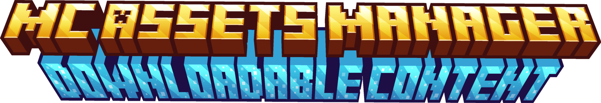
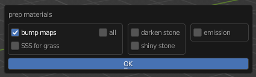

# McAM-DLCs 
* [Default Items](#default-items)
* [Preset Helper](#preset-helper)
* [NFX Swords](#nfx-swords)
* [World Importer](#world-importer)
* [Wan Xi's Assets](#wan-xis-assets)

## Default Items
This DLC contains a few default Minecraft items.
 

## Preset Helper

The Preset Helper DLC makes creating presets easier and will help you managing them in a <em>work in progress</em> folder of the addon. It provides more operators which will make extruding hair much easier.

You can open unfinished presets, make new ones, mark unfinished ones as finished and remove preset files. The addon also gives you the possibility to add the subdivision and solidify modifier to the selected objects. This comes in handy especially when making hair of the Minecraft character.
 

## NFX Swords

This asset collection contains multiple different swords.

You can change the texture with the int property under item : properties.

You can check out the creator here: [Discord](https://discord.gg/Pvt2KneRNQ) | [YouTube](https://www.youtube.com/channel/UCgm0fyoER5KC8mGVjfXJWDw) | [Twitter](https://twitter.com/NightGFX_)
 

## World Importer

The World Importer DLC makes it easy to import .obj world files into blender. It allows to prep the materials as well - settings can be seen in the screenshot.
 

## Wan Xis Assets
This DLC contains many Wan Xi public assets available on his discord server.
 
