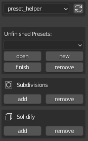
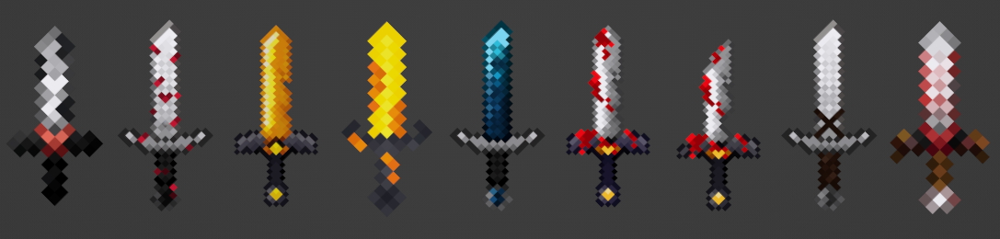
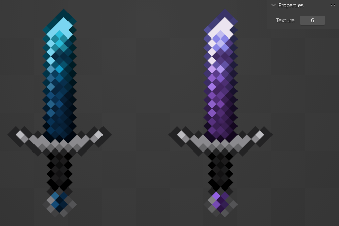

# McAM-DLCs
- Preset Helper
- NFX Swords [1]
- world importer
  
## Preset Helper

The Preset Helper DLC makes creating presets easier and will help you managing them in a _work in progress_ folder of the addon. It provides more operators which will make extruding hair much easier.

You can open unfinished presets, make new ones, mark unfinished ones as finished and remove preset files. The addon also gives you the possibility to add the subdivision and solidify modifier to the selected objects. This comes in handy especially when making hair of the Minecraft character.
 

## NFX Swords [1]

This asset collection contains multiple different swords.

You can change the texture with the int property under item : properties.

You can check out the creator here: [Discord](https://discord.gg/Pvt2KneRNQ) | [YouTube](https://www.youtube.com/channel/UCgm0fyoER5KC8mGVjfXJWDw)

## World Importer

